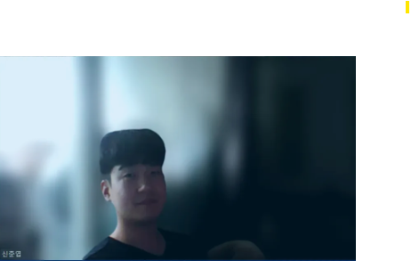

# Upstage AI Lab ML Competition - 김신정이

## Team

|         |           |              |        |
| :-------------------------------------: | :---------------------------------------: | :------------------------------------------: | :------------------------------------: |
| [정소현](https://github.com/soniajhung) | [신준엽](https://github.com/Shin-junyeob) | [이준영](https://github.com/junyeonglee1111) | [김승완](https://github.com/wan-seung) |
|        팀장, Feature Engineering        |            Feature Engineering            |             Feature Engineering              |          Feature Engineering           |

## 1. Competition Info

### Overview

- Upstage AI Lab 14기 ML 1차 경진대회
- 서울시 아파트 실거래가 매매 데이터를 기반으로 아파트 가격 예측
- 외부데이터 버거지수 활용
- 서울시 중학교 학업성취도 활용

### Timeline

- 프로젝트 시작: 2025년 7월 7월
- 최종 제출 마감: 2025년 7월 17일

### Evaluation

- 매출 예측 정확도 평가
- RMSE (Root Mean Square Error) 기준

## 2. Components

### Directory Structure

```
upstageailab-ml-competition-ml-6/
├── junyub/                    # 신준엽 - 데이터 수집
│   ├── code/
│   │   ├── burgerking.py
│   │   └── mcdonalds.py
│   └── data/                 # 쉽게 모델링 할수 있도록 데이터 수정한 파일들
├── leejy/                     # 이준영
│   ├── code/
│   │   └── subway_time.ipynb # 지하철 데이터 분석 및 정제 (역과 강남역 사이의 직선거리 계산)
│   └── data/                 # 지하철 관련 데이터
├── seungwan/                  # 김승완
│   ├── base/
│   │   ├── EDA_Clean_wanie.py     # ipynb 파일 py코드로 변환
│   │   └── EDA_Clean_wanie.ipynb  # 소현님께서 작업해주신 EDA 노트북에 로그 트랜스포메이션 적용
│   └── data/                 # 처리된 데이터
├── sohyun/                    # 정소현
│   ├── EDA_Clean_sohyun.ipynb     # EDA 및 데이터 정제
│   ├── FastFood_sohyun.ipynb      # 패스트푸드 분석
│   ├── fetch_branches.ipynb       # 매장 정보 수집
│   ├── FastFood/             # 패스트푸드 인허가 데이터
│   └── kakao_burger_all_seoul.csv # 카카오 맵 API 데이터
├── Public/                    # 공통 코드 및 결과
│   ├── code/
│   │   ├── baseline_code.ipynb    # 공통 베이스라인
│   │   └── requirements.txt       # 의존성 패키지
│   ├── data/                 # 공통 데이터
│   └── results/              # 최종 결과
├── docs/                     # 문서
│   └── pdf/                  # 발표 자료
├── results/                  # 최종 결과물
```

## 3. Data Description

- **패스트푸드 매장 데이터**: 버거킹, 맥도날드, 롯데리아, 맘스터치, KFC 매장 정보
- **지하철 데이터**: 서울시 지하철 역별 시간대별 이용객 수
- **인허가 데이터**: 서울시 일반음식점 및 휴게음식점 인허가 정보
- **카카오 맵 API 데이터**: 서울시 패스트푸드점 위치 및 상세 정보

### EDA (Exploratory Data Analysis)

#### 정소현 (sohyun/)

- 인허가 데이터 기반 매장 정보 정제
- 카카오 맵 API를 통한 매장 위치 데이터 수집

#### 김승완 (seungwan/)

- 베이스라인 모델을 위한 데이터 전처리
- 중학교 위치 데이터와 매장 데이터 결합
- 로그 변환 및 정규화 적용

### Feature Engineering

- **위치 기반 특성**: 지하철역, 학교, 상권과의 거리
- **시간대별 특성**: 지하철 이용객 수, 시간대별 매출 패턴
- **매장 특성**: 매장 규모, 인허가 정보, 브랜드별 특성

## 4. Modeling

### Model Description

- **베이스라인 모델**: 기본적인 회귀 모델을 통한 매출 예측
- **앙상블 모델**: 여러 모델의 조합을 통한 성능 향상
- **특성 선택**: 상관관계 분석을 통한 중요 특성 선별

### Modeling Process

1. **데이터 전처리**: 결측치 처리, 이상치 제거, 정규화
2. **특성 엔지니어링**: 위치 기반 특성 생성, 시간대별 특성 추가
3. **모델 학습**: 교차 검증을 통한 하이퍼파라미터 튜닝
4. **성능 평가**: RMSE 기준 모델 성능 측정

## 5. Result

### Leader Board

- 7등..😂
- RMSE 102984.4221

### Presentation

- [발표 자료](https://drive.google.com/file/d/1qDE6M0GI5JlmiwG0keGopdh-5TdpWRh1/view?usp=drive_link)

## etc

### Meeting Log

- 팀 미팅 기록은 아직 없습니다

### Reference

- 서울시 공공데이터 포털
- 지하철역 및 버스정류장 추가 데이터
- 카카오 맵 API
- 패스트푸드 업계 데이터
- 중학교 학업성취도 자료
